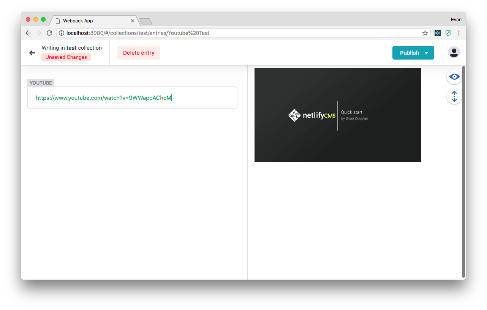

[](https://www.npmjs.com/package/netlify-cms-widget-youtube)

[](https://www.npmjs.com/package/netlify-cms-widget-youtube)

## NO LONGER MAINTAINED - LOOKING FOR MAINTAINER

# netlify-cms-widget-youtube

[Check out a demo!](https://netlify-cms-widget-youtube.netlify.com/#/collections/test/entries/youtube_test)

Provides a simple text input for youtube videos. Validates strings with a green text color and provides a preview image in the preview pane.

### Looking for suggestions for additional functionality. PRs are Welcome!



## Install

As an npm package:

```shell
npm install --save netlify-cms-widget-youtube
```

```js
import youtube from "netlify-cms-widget-youtube";

CMS.registerWidget("youtube", youtubeControl, youtubePreview);
```

Via `script` tag:

```html
<script src="https://unpkg.com/netlify-cms-widget-youtube@^0.3.0"></script>

<script>
  CMS.registerWidget('youtube', youtubeControl, youtubePreview)
</script>
```

## How to use

Add to your Netlify CMS configuration:

```yaml
    fields:
      - { name: <fieldname>, label: <fieldlabel>, widget: youtube, extraInfo: false, APIkey: "<KEY>" }
```

Enabling `extraInfo` will return an object in frontmatter

```js
<fieldname>:
	url: String
	id: String
	mediaType: String
	imageURL: String
```

If you provide an API KEY in the configuration you will get additional information in the Control (as seen in the screenshot above). You can use this API key here to test but it's better you get your own to make sure it always works!

## FAQ

#### Q: My control doesn't show the title or description

You need to add an API Key to the widget settings. Learn about getting an API Key [here](https://developers.google.com/youtube/v3/getting-started)

#### Q: How can I get and image url in my output

You need to add `extraInfo: true` to your Netlify CMS configuration <small>(_usually config.yml_)</small>

## Roadmap

*   [x] Youtube Image in Preview
*   [x] Extended Details in Control from Youtube Data API
*   [x] Optional YAML object output
*   [ ] Youtube Search function
*   [ ] Couple with a Youtube "Editor Widget"

## Support

For help with this widget, open an [issue](https://github.com/hennessyevan/netlify-cms-widget-youtube) or ask the Netlify CMS community in [Gitter](https://gitter.im/netlify/netlifycms).
